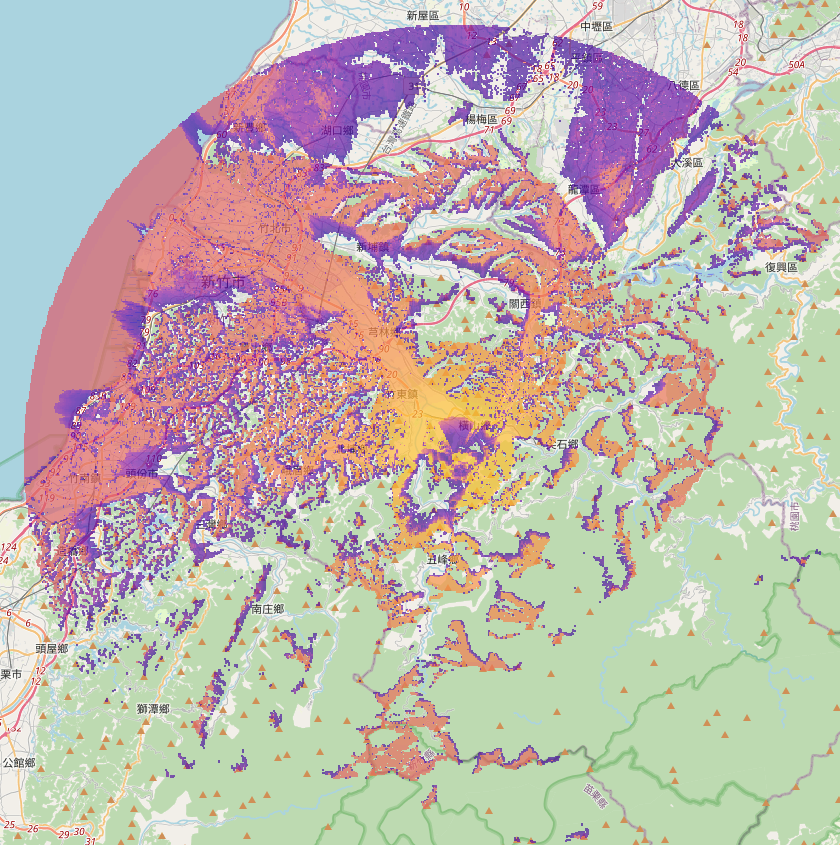
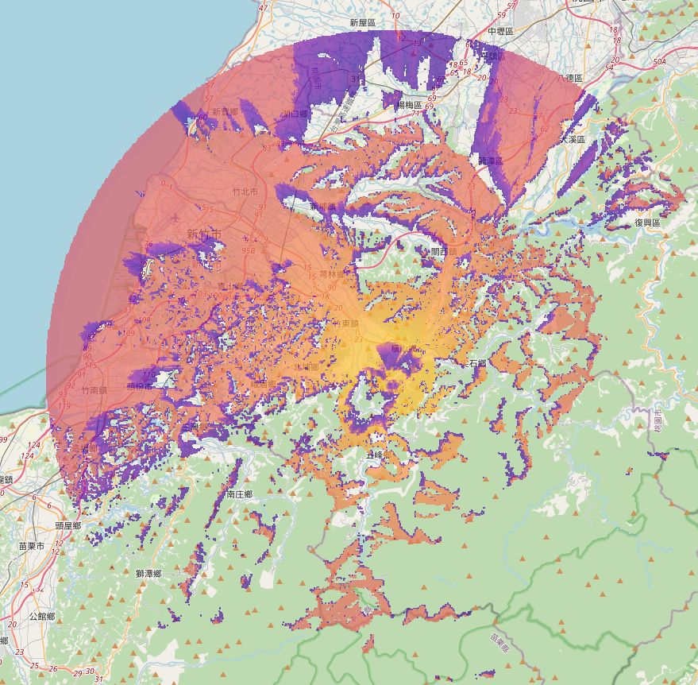

# 橫山大崎棟 HSDC Meshtastic 節點訊號測試

- 測試軟體：[Meshtastic Site Planner](https://site.meshtastic.org/)

## 訊號模擬結果

### 1. 橫山大崎棟 HSDC 對手持節點訊號模擬

- [參數](./handheld-TX915-JDK-20/parameter.md)

### 2. 橫山大崎棟 HSDC 對透天房屋屋頂4樓節點訊號模擬

- [參數](./house-4-GT-BLG20-40-L/parameter.md)

